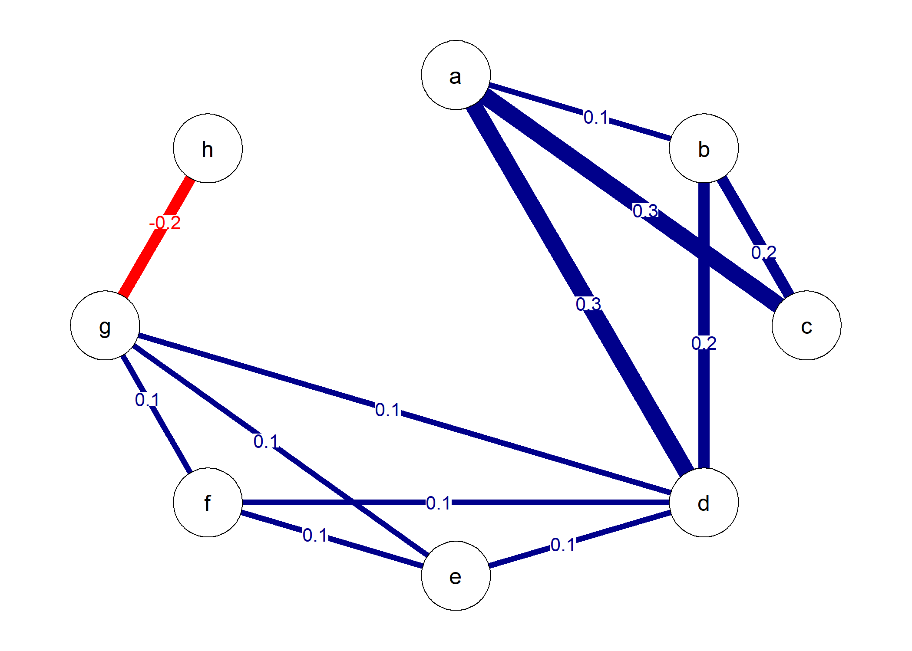
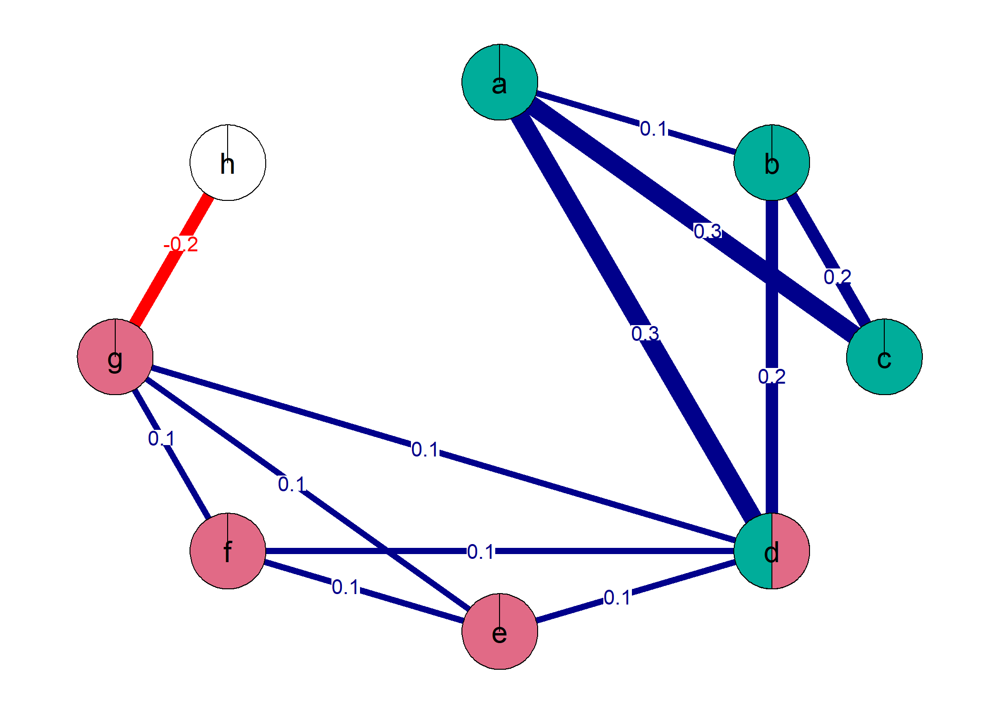

# Summary and Statement of Need

Modeling complex phenomena as networks constitutes one -- if not the most -- versatile field of research [@Barabasi:2011]. Indeed, many interconnected entities can be represented as networks, in which entities are called *nodes* and their connections are called *edges*. For instance, networks can represent friendships between people, hyperlinks between web pages, or correlations between questionnaire items. One structural characteristic of networks that is investigated frequently across various sciences is the detection of *communities* [@Fortunato:2010]. Communities are strongly connected subgraphs in the network such as groups of friends, thematic fields, or latent factors. Most community detection algorithms thereby put each node in only one community. However, nodes are often shared by multiple communities, e.g., when a person is part of multiple groups of friends, web pages belong to different thematic fields, or items load on multiple factors. The most popular community detection algorithm that is aimed at identifying such overlapping communities is the *clique percolation algorithm* [@Farkas+et+al:2007; @Palla+et+al:2005].

The clique percolation algorithm is not yet implemented in a package in **R** [@R:2020]. So far, the primary software for running the algorithm is the standalone program [**CFinder**](http://www.cfinder.org/), written in **C++** and **Java** [@Adamcsek+et+al:2006]. However, **CFinder** cannot be used to construct networks from data or to visualize the solutions of the algorithm, requiring the simultaneous use of other software such as **R**. Handling multiple programs impedes a smooth workflow. Next to **CFinder**, an **R** function for running one variant of the clique percolation algorithm is available in a [GitHub repository](https://github.com/angelosalatino/CliquePercolationMethod-R). However, it is not implemented in a package and lacks functions for optimizing parameters of the algorithm as well as plotting its results. **CliquePercolation** overcomes these limitations as it entails functions for helping to optimize parameters of the algorithm, running the algorithm, and plotting the results.

## A minimal example

The structure of a network can be captured in a matrix. An undirected network of $n$ nodes translates into a symmetric square $n$-by-$n$ matrix. Each element $a_{ij}$ takes the value 0, if there is no edge between nodes $i$ and $j$. If there is an edge, in a *unweighted* network, $a_{ij}$ takes the value 1, and in a *weighted* network, it takes any non-zero value. The **R** package **qgraph** [@Epskamp+et+al:2012] can visualize such networks. For instance, a weighted network with eight nodes $a$ to $h$ as depicted in \autoref{fig:fig1} results from running

&nbsp;

\small


```r
library(qgraph) #version 1.6.5
W <- matrix(c(0 , .1, .3, .3,  0,  0,   0,   0,
              .1,  0, .2, .2,  0,  0,   0,   0,
              .3, .2,  0,  0,  0,  0,   0,   0,
              .3, .2,  0,  0, .1, .1,  .1,   0,
               0,  0,  0, .1,  0, .1,  .1,   0,
               0,  0,  0, .1, .1,  0,  .1,   0,
               0,  0,  0, .1, .1, .1,   0, -.2,
               0,  0,  0,  0,  0,  0, -.2,   0),
            nrow = 8, ncol = 8, byrow = TRUE)
rownames(W) <- letters[seq(from = 1, to = nrow(W))]
colnames(W) <- letters[seq(from = 1, to = nrow(W))]
W <- qgraph::qgraph(W,
                    theme = "colorblind",
                    cut = 0.02,
                    edge.labels = TRUE)
```



\normalsize

&nbsp;

The clique percolation algorithm proceeds in two steps. First, it identifies $k$-cliques in the network, i.e., fully conntected subgraphs with $k$ nodes, when the geometric mean of their edge weights exceeds the Intensity threshold $I$. Second, communities are defined as sets of adjacent $k$-cliques, i.e., $k$-cliques that share $k - 1$ nodes, allowing some nodes to be shared by communities or to be isolated.

The package **CliquePercolation** faciliates executing these steps. First, it helps identifying optimal values for $k$ and $I$. For very small networks (as in \autoref{fig:fig1}), the entropy of the community partition should be maximized (treating isolated nodes as a separate community).

\begin{equation}
Entropy = -\sum_{i=1}^N p_i * \log_2 p_i
\end{equation}

where $N$ is the number of communities and $p_i$ is the probability of being in community $i$. Entropy is maximal when the resulting communities are equally sized with a small number of isolated nodes. A permutation test, which repeatedly randomly shuffles the edges in the network and recalculates entropy can point out which entropy values are higher than already expected by chance.

In **CliquePercolation** the `cpThreshold` function calculates entropy for a range of $k$ and $I$ values.

&nbsp;

\small


```r
library(CliquePercolation) #version 0.3.0
threshold <- cpThreshold(W, method = "weighted",
                         k.range = c(3,4),
                         I.range = seq(0.3, 0.09, -0.01),
                         threshold = "entropy")
```

\normalsize

&nbsp;

and the `cpPermuteEntropy` function runs the permutation test

&nbsp;

\small


```r
set.seed(4186)
thresholds.permute <- cpPermuteEntropy(W, cpThreshold.object = threshold)
```

\normalsize

&nbsp;

returning the combinations of $k$ and $I$ that are more surprising than chance

&nbsp;

\small


```r
thresholds.permute$Extracted.Rows
#>    k Intensity Number.of.Communities Number.of.Isolated.Nodes Entropy.Threshold
#> 22 3      0.09                     2                        1          1.418564
#> 44 4      0.09                     1                        4          1.000000
```

\normalsize

&nbsp;

The highest entropy results for $k = 3$ and $I = 0.09$, which can be used to run the clique percolation algorithm for weighted networks with the `cpAlgorithm` function.

&nbsp;

\small


```r
cp.k3I.09 <- cpAlgorithm(W, k = 3, method = "weighted", I = 0.09)
```

\normalsize

&nbsp;

The algorithm identified two communities

&nbsp;

\small


```r
cp.k3I.09$list.of.communities.labels
#> [[1]]
#> [1] "d" "e" "f" "g"
#> 
#> [[2]]
#> [1] "a" "b" "c" "d"
```

\normalsize

&nbsp;

with one shared node

&nbsp;

\small


```r
cp.k3I.09$shared.nodes.labels
#> [1] "d"
```

\normalsize

&nbsp;

and one isolated node.

&nbsp;

\small


```r
cp.k3I.09$isolated.nodes.labels
#> [1] "h"
```

\normalsize

&nbsp;

Hence, the two adjacent 3-cliques $a$--$b$--$c$ and $a$--$b$--$d$ form a community and the four adjacent 3-cliques $d$--$e$--$f$, $d$--$e$--$g$, $d$--$f$--$g$, and $e$--$f$--$g$ form another community, leading node $d$ to be shared between both communities and node $h$ to be isolated.

The function `cpColoredGraph` can visualize the results. For instance, using the default color scheme, all nodes that belong to the same community get the same color, shared nodes are split in multiple parts with colors for each community they belong to, and isolated nodes are white (see \autoref{fig:fig2}).

&nbsp;

\small


```r
col_graph <- 
  cpColoredGraph(W,
                 list.of.communities = cp.k3I.09$list.of.communities.labels,
                 theme = "colorblind",
                 cut = 0.02,
                 edge.labels = TRUE)
```



\normalsize

&nbsp;

Beyond this minimal example, the **CliquePercolation** package provides more functionality for applying the clique percolation algorithm to different kinds of networks and plotting the results. The full suite of possibilities is described in the package vignette, which is available by running `vignette("CliquePercolation")`. Moreover, an elaborate [blog post](https://psych-networks.com/r-tutorial-clique-percolation-to-detect-communities-in-networks/) used the package in research on a psychological disorder network and a recent publication applied the package in research on emotions [@Lange+Zickfeld:2021].

# Acknowledgements

The development of **CliquePercolation** greatly benefitted from discussions with Janis Zickfeld and Tessa Blanken. Moreover, Gergely Palla provided important insights into the clique percolation algorithm as implemented in **CFinder** and recommended the entropy-based method. The development of **CliquePercolation** was also supported by two grants from the German Research Foundation (Deutsche Forschungsgemeinschaft; LA 4029/1-1; LA 4029/2-1).

# References
